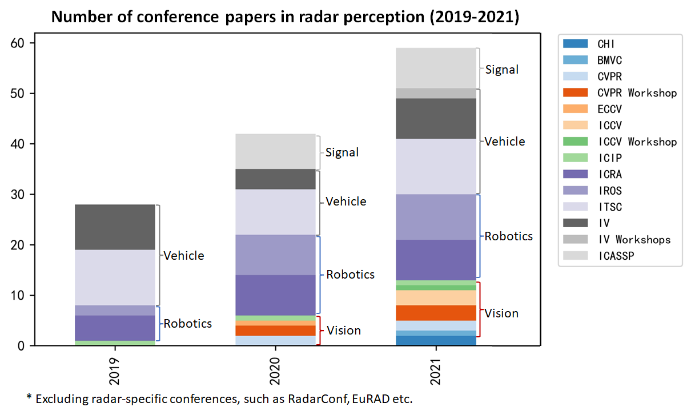

# Awesome Radar Perception
A curated list of radar datasets, detection, tracking and fusion.  Keep updating. Author: Yi Zhou Contact: zhouyi1023@tju.edu.cn
 Update some public-available codes, see [useful_codes.md](./useful_codes.md)

🚩 The View-of-Delft dataset is public available. [Homepage](https://tudelft-iv.github.io/view-of-delft-dataset/)

🚩 There are three papers about radar in the coming CVPR 2022.
 [Modality-Agnostic Learning for Radar-Lidar Fusion in Vehicle Detection](https://openaccess.thecvf.com/content/CVPR2022/html/Li_Modality-Agnostic_Learning_for_Radar-Lidar_Fusion_in_Vehicle_Detection_CVPR_2022_paper.html) 	
 [Raw High-Definition Radar for Multi-Task Learning](https://openaccess.thecvf.com/content/CVPR2022/html/Rebut_Raw_High-Definition_Radar_for_Multi-Task_Learning_CVPR_2022_paper.html)
 [Exploiting Temporal Relations on Radar Perception for Autonomous Driving](https://openaccess.thecvf.com/content/CVPR2022/html/Li_Exploiting_Temporal_Relations_on_Radar_Perception_for_Autonomous_Driving_CVPR_2022_paper.html)

🚩I have published a review paper on radar perception. Please see the link below. It is open access. If you find the contents are useful, please cite this paper in your work. I will keep updating this repository for the latest works in the radar perception field.

## [Towards Deep Radar Perception for Autonomous Driving: Datasets, Methods, and Challenges](https://www.mdpi.com/1424-8220/22/11/4208)

## The 41-page slides associated with this paper: [Link](https://www.slideshare.net/YiZhou66/slidesdeepradarperceptionforautonomousdrivingpdf) ; [Link for China Mainland](https://www.aliyundrive.com/s/CZ3SKqY3U4w) 

Radar perception is getting popular. More and more researchers from computer vision, intelligent vehicle and robotics are starting to enter this field. I hope my review article and this repository can be a good starting point for these newcomers.

    

 

---

## Contents
Overview
- [Review](#Review-Papers)
- [Seminars and Workshops](#Seminars-and-Workshops)

Data Perspective:
- [Radar Datasets](#Radar-Datasets)
- [Radar Signature](#Radar-Signature)
- [Calibration](#Calibration)
- [Labelling](#Labelling)
- [Augmentation](#Data-Augmentation)
- [Simulation](#Simulator)
- [Generative Model](#Generative-Model)
- [Testing](#Testing)

Signal Processing:
- [Radar Toolbox](#Radar-Toolbox)
- [Detector](#Detector)
- [Super Resolution](#Super-Resolution)
- [Clustering](#Clustering)
- [Denoising](#Denoising)

Applications:
- [Ego-Motion Estimation]()
- [Velocity Estimation](#Velocity-Estimation)
- [Depth Estimation](#Depth-Estimation)
- [Object Detection](#Object-Detection)
- [Sensor Fusion](#Sensor-Fusion)
- [Weakly Supervised](#Weakly-Supervised)
- [Mutiple Object Tracking]()
- [Odometry and SLAM]()
- [Micro-Doppler for HAR]()
- [Radar-Audio]()

Challenges:
- [Weather Effect](#Weather-Effect)
- [Multi Path Effect](#Multi-Path-Effect)
- [Mutual Interference](#Mutual-Interference)
- [Cell Migration](#Range-and-Doppler-Cell-Migration)
- [Tx-Rx Leakage](#Tx-Rx-Leakage)
- [Imperfect Waveform Separation](#Imperfect-Waveform-Separation)
 

---

## Radar Datasets
In my [review paper](https://www.mdpi.com/1424-8220/22/11/4208), there is a table with more detials.

### Conventional Radar Datasets for Autonomous Driving
| Dataset | Radar Type | Data Type| Annotation | Link |
| ---- |----| ---- | ---- | ---- |
| nuScenes | Continental ARS408 x5 | Sparse PC | 3D bbox, TrackID | [Website](https://www.nuscenes.org/) |
| DENSE| 77Ghz Long-Range Radar | Sparse PC | 3D bbox |[Website](https://www.uni-ulm.de/en/in/driveu/projects/dense-datasets) |
| PixSet| TI AWR1843| Sparse PC | 3D bbox, TrackID|  [Website](https://leddartech.com/solutions/leddar-pixset-dataset/)|
| Radar Scenes | 77GHz Middle-Range Radar x4 | Dense PC |2D point-wise, TrackID| [Website](https://radar-scenes.com/)|
| Pointillism | 2 TI AWR 1443 | PC | 3D bbox | [Github](https://github.com/Kshitizbansal/pointillism-multi-radar-data) |
| Zendar SAR | SAR | ADC, RD, PC|Pointwise Mask of Moving Vehicle |[Github](https://github.com/ZendarInc/ZendarSDK) |

 Comments: nuScenes, DENSE and Pixset are for sensor fusion, but not particularly address the role of radar. Radar scenes provides point-wise annotations for radar point cloud, but has no other modalities. Pointillism uses 2 radars with overlapped view. Zendar seems no longer available for downloading.

### Pre-CFAR Datasets for Detection
| Dataset | Radar Type | Data Type| Annotation | Link |
| ---- |----| ---- | ---- | ---- |
| CRUW |  TI AWR1843 Ultra Short Range | RA | Pointlevel Object |[Website](https://www.cruwdataset.org/home)|
| CARRADA | TI AWR1843 Short Range | RA,RD,RAD | Pointwise, 2D bbox, Mask | [Website](https://arthurouaknine.github.io/codeanddata/carrada)|
| RADDet | TI AWR1843 | RAD | 3D bbox for RAD tensor | [Github](https://github.com/ZhangAoCanada/RADDet) |
| RaDICaL | TI IWR1443 | ADC | 2D bbox | [Website](https://publish.illinois.edu/radicaldata/)|
| GhentVRU | TI AWR1243 Short Range | RAD | Segmentation Mask for VRUs| [Paper](https://ieeexplore.ieee.org/document/9294399) |

 Comments: CARRADA is captured in clean scenarios, CRUW uses RA maps, RADDet provides annotations for RAD tensor, RADICaL provides raw ADC data and signal processing toolboxes, GhentVRU can be accssed by contacting with authors.

### 4D Radar Datasets for Detection
| Dataset | Radar Type | Data Type| Annotation | Link |
| ---- |----| ---- | ---- | ---- |
| Astyx  Hires2019 | Astyx 6455 HiRes Middel Range| PC | 3D bbox|[Dateset](https://github.com/under-the-radar/radar_dataset_astyx)|
| View-of-Delft | ZF FRGen21 Short Range| PC | 3D bbox |[Website](https://intelligent-vehicles.org/datasets/view-of-delft/)|
| RADIal | Valeo Middel Range DDM | ADC,RAD,PC | Point-level Vehicle; Open Space Mask|[Github](https://github.com/valeoai/RADIal)|
| TJ4DRadSet | Oculii Eagle Long Range | PC |  3D bbox, TrackID| [Github](https://github.com/TJRadarLab/TJ4DRadSet) |
|K-Radar| Macnica RETINA | RAD |3D bbox, Track ID|[Github](https://github.com/kaist-avelab/K-Radar)|

 Comments: Astyx is small, VoD focuses on VRU classification, RADIal's annotation is coarse but provides raw data, TJ4D features for its long range detection, K-Radar provides RAD tensor and 3D annotations. TJ4D and K-radar are not yet public available. 

### Specific Tasks
| Dataset | Radar Type | Task | Link |
| ---- |----| ---- | ---- |
| HawkEye | SAR | Static vehicle classification | [Website](https://jaydeng1019.github.io/HawkEye/)|
| PREVENTION | Conti ARS308 + SRR208 x2 | Trajectory Prediction | [Website](https://prevention-dataset.uah.es/)|
| SCORP | 76GHz | Open space segmentation | [Website](https://sensorcortek.ai/paper-and-datasets/) |
| Ghost | 77GHz long range *2  | Ghost object detection | [Github](https://github.com/flkraus/ghosts) |
| Solinteraction Data | Soli | Tangible interactions| [Github](https://github.com/tcboy88/solinteractiondata) |
| GROUNDED | Ground Penetrating Radar | Localization | [Website](https://lgprdata.com/)|
|FloW Dataset | TI AWR1843 | Floating waste detection | [Website](http://orca-tech.cn/datasets/FloW/Introduction) |
| OLIMP | UWB + Continental ARS404|  Multi-sensor fusion for detection|[Website](https://sites.google.com/view/ihsen-alouani/datasets)|

### Odometry and Localization
| Dataset | Radar Type | Task | Link |
| ---- |----| ---- | ---- | 
| Oxford Radar Robocar | Navtech Spinning Radar |  Odometry, (Detection) | [Website](https://oxford-robotics-institute.github.io/radar-robotcar-dataset/); [Detection Annotation](https://github.com/qiank10/MVDNet) |
|RADIATE| Navtech Spinning  Radar | Odometry, Detection, Tracking | [Website](http://pro.hw.ac.uk/radiate/doc/dataset/)|
| MulRan | Navtech Spinning  Radar | Place Recognition |[Website](https://sites.google.com/view/mulran-pr/dataset)|
| Boreas | Navtech Spinning  Radar|   Long-term Odometry, Localization, Detection | [Website](https://www.boreas.utias.utoronto.ca/#/)|
| EU Long-term Dataset | Conti ARS 308 | Long-term SLAM | [Website](https://epan-utbm.github.io/utbm_robocar_dataset/)|
| ColoRadar | TI AWR2243 Cascade + AWR1843 |Odometry |  [Website](https://arpg.github.io/coloradar/) |
| USVInland | TI AWR1843 | SLAM in inland waterways, Water segmentation| [Website](http://orca-tech.cn/datasets/USVInland/Introduction) |
| Endeavour Radar Dataset | Conti ARS 430 x5 | Odometry | [Website](https://gloryhry.github.io/2021/06/25/Endeavour_Radar_Dataset.html)|
| OdomBeyondVision |  TI AWR1843 | Odometry | [Website](https://github.com/MAPS-Lab/OdomBeyondVision) |

### Human Activity
| Dataset | Radar Type | Data Type | Task | Link |
| ---- |----| ---- | ---- | ---- | 
| DopNet | 24GHz | Spectrogram | Gesture | [Website](http://dop-net.com/)|
| MCD-Gesture | 77GHz | RAD tensor |Gesture | [Website](https://github.com/DI-HGR/cross_domain_gesture_dataset)|
|DeepSoli | 60GHz | RD map | Gesture | [Website](https://github.com/simonwsw/deep-soli) | 
| Radar signatures of human activities  | 5.8 GHz | ADC | Human activities | [Dataset](http://researchdata.gla.ac.uk/848/) |
|Ci4R human activity dataset | 77GHz & 24GHz & 10GHz |Spectrogram | Human activities | [Website](https://github.com/ci4r/CI4R-Activity-Recognition-datasets/) |
| RadHAR | 77GHz | Point Cloud | Human activities  | [Website](https://github.com/nesl/RadHAR) |
| Vital Sign | 60GHz| ADC, heart/breathing rate  | Child vital sign | [Dataset](https://figshare.com/s/936cf9f0dd25296495d3) |

---

## Radar Toolbox
### Simulation
RadarSimPy: [Code](https://github.com/rookiepeng/radarsimpy); 
Virtual Radar: [Code](https://github.com/chstetco/virtualradar); 
MaxRay: [Paper](https://arxiv.org/abs/2112.01751)

### TI Signal Processing SDK:
RaDICaL's Toolbox: [SDK](https://github.com/moodoki/radical_sdk);  PyRapid: [SDK](http://radar.alizadeh.ca); OpenRadar : [SDK](https://github.com/presenseradar/openradar); Pymmw: [SDK](https://github.com/m6c7l/pymmw); Open radar initiative: [SDK](https://github.com/openradarinitiative); RADIal's Emptyband-DDM Script: [Code](https://github.com/valeoai/RADIal/tree/main/SignalProcessing) 

### Official SDK:
NXP Premium Radar SDK: [Link](https://www.nxp.com/design/automotive-software-and-tools/premium-radar-sdk-advanced-radar-processing:PREMIUM-RADAR-SDK); TI mmWAVE Studio: [Link](https://www.ti.com/tool/MMWAVE-STUDIO); TI Toolbox: [Link](https://dev.ti.com/tirex/explore/node?node=AHJY4qNCowO17wH-P2ICKQ); Matlab Radar Toolbox: [Link](https://uk.mathworks.com/products/radar.html)

### Data Capturing:
TI Radar and Camera in Python:[Code](https://github.com/yizhou-wang/cr-data-collector); 
Ainstein Radar ROS Node: [ROS Node](https://github.com/AinsteinAI/ainstein_radar); Continental ARS 408 ROS Node: [ROS Node](https://gitlab.com/ApexAI/autowareclass2020/-/tree/master/code/src/09_Perception_Radar/Radar-Hands-On-WS); TI mmWave ROS Driver: [Guide](https://dev.ti.com/tirex/explore/node?node=ADINBw2NDaxb6JeW7V-lMQ__VLyFKFf__LATEST&search=ROS); RaDICaL's TI ROS Node: [ROS Node](https://github.com/moodoki/iwr_raw_rosnode); UoA's TI ROS Package: [ROS Node](https://github.com/radar-lab/ti_mmwave_rospkg)

---

## Seminars and Workshops

* 2021 ICRA Radar Perception for All-Weather Autonomy [[Website]](https://sites.google.com/view/radar-robotics/home)
* 2021 ICASSP Recent Advances in mmWave Radar Sensing for Autonomous Vehicles [[Website]](https://www.2021.ieeeicassp.org/Papers/ViewSession_MS.asp?Sessionid=1280)
* Radar in Action Series by Fraunhofer FHR [[Video]](https://www.youtube.com/hashtag/radarinaction)
* IEEE AESS Virtual Distinguished Lecturer Webinar Series [[Website]](https://ieee-aess.org/activities/educational-activities/distinguished-lecturers)
* Journal of Radar Webinar Series (in Chinese) [[Video]](https://space.bilibili.com/1288394672)

* Markus Gardill: Automotive Radar – An Overview on State-of-the-Art Technology [[Video]](https://www.youtube.com/watch?v=P-C6_4ceY64&t=2416s)
* Markus Gardill: Automotive Radar – A Signal Processing Perspective on Current Technology and Future Systems [[Video]](https://www.youtube.com/watch?v=IxoPYhXY30k&t=11s)[[Slides]](https://cloud.gardill.net/s/tjoSLSB7fXWTEBb)
* Francesco Fioranelli: Radar Old but Gold- current research challenges and activities in radar micro-Doppler signatures [[Video]](https://www.youtube.com/watch?v=ysL6rk-4L9o&list=PLa5-fgjZm9MtJBtb6M3YplIDSdgr1m94n&index=3)
* Andrej Karpathy from Tesla:  [[Video]](https://www.youtube.com/watch?v=g6bOwQdCJrc)
* Ole Schumann: Radar Perception for Automated Driving – Data and Methods [[Video]](https://www.youtube.com/watch?v=UQL7_Zy2Kjg&t=73s)
* Sani Ronen from Arbe: Using AI layer to transform HR radar into insights for Autonomous Driving applications [[Video]](https://www.youtube.com/watch?v=TtJW-c02YH8)
* Stefan Haag: Co-Development of Automatic Annotation for ML and Sensor Fusion Improvement System  [[Video]](https://www.youtube.com/watch?v=ANbmXg2TxlE)
* Arthur Ouaknine: Deep Learning & Scene Understanding for autonomous vehicle [[Video]](https://www.youtube.com/watch?v=sOOvnTCnhPg)
* Paul Newman: The Road to Anywhere-Autonomy [[Video]](https://www.youtube.com/watch?v=MzYQMRG9HW0)
* Jaime Lien: Soli: Millimeter-wave radar for touchless interaction [[Video]](https://www.youtube.com/watch?v=JFr8Whnx630)
* Accelerating end-to-end Development of Software-Defined 4D Imaging Radar [[Videp]](https://www.youtube.com/watch?v=QPoj1zM2vCs)
* Radar-Imaging - An Introduction to the Theory Behind [[Video]](https://www.youtube.com/watch?v=ej2smyTZLHE)
* NXP - Radar Experts Discuss the Evolution of Automotive Radar [[Video]](https://www.youtube.com/watch?v=RfJiiSlesyE&t=347s)
* Need to Successfully Design a Milimeter-Wave Automotive Radar Antenna? [[Video]](https://www.youtube.com/watch?v=0lK8qJSWY_c)
* Webinar SAR Imaging using Ancortek’s Software Defined Radars [[Video]](https://www.youtube.com/watch?v=BMSVvQJYCIs)

---

## Review Papers

Radar Hardware:
* [Millimeter-Wave Technology for Automotive Radar Sensors in the 77 GHz Frequency Band](https://ieeexplore.ieee.org/document/6127923)
* [Antenna Concepts for Millimeter-Wave Automotive Radar Sensors](https://ieeexplore.ieee.org/document/6165323)

Radar Signal Processing:
* General: [The Rise of Radar for Autonomous Vehicles: Signal Processing Solutions and Future Research Directions](https://ieeexplore.ieee.org/document/8828025/)
* Signal Processing: [Radar-on-Chip/in-Package in Autonomous Driving Vehicles and Intelligent Transport Systems](https://ieeexplore.ieee.org/document/9369027)
* Signal Processing: [Automotive Radars A review of signal processing techniques](https://ieeexplore.ieee.org/abstract/document/7870764)
* MIMO: [MIMO Radar for Advanced Driver-Assistance Systems and Autonomous Driving: Advantages and Challenges](https://ieeexplore.ieee.org/document/9127853)
* Digital Radar: [High-Performance Automotive Radar: A Review of Signal Processing Algorithms and Modulation Schemes](https://ieeexplore.ieee.org/document/8828004)
* Micro-Doppler: [Micro-Doppler Effect in Radar: Phenomenon, Model, and Simulation Study](https://ieeexplore.ieee.org/document/1603402)
* Dynamic Range: [Dynamic Range Considerations for Modern Digital
Array Radars](https://ieeexplore.ieee.org/document/9114607)
* Phase Noise: [On the Safe Road Toward Autonomous Driving: Phase Noise Monitoring in Radar Sensors for Functional Safety Compliance](https://ieeexplore.ieee.org/document/8827996)
* Interference: [Radar Interference Mitigation for Automated Driving: Exploring Proactive Strategies](https://ieeexplore.ieee.org/document/9127843)
* Interference: [Interference in Automotive Radar Systems: Characteristics, Mitigation Techniques, and Current and Future Research](https://ieeexplore.ieee.org/document/8828037)

Automotive Radar Applications:
* Detection,Fusion for Autonomous Driving: [Towards Deep Radar Perception for Autonomous Driving: Datasets, Methods, and Challenges](https://www.mdpi.com/1424-8220/22/11/4208)
* Signal Processing: [Automotive Radar Signal Processing: Research Directions and Practical Challenges](https://ieeexplore.ieee.org/document/9369027)
* Interference: [Interference Suppression Using Deep Learning: Current Approaches and Open Challenges](https://ieeexplore.ieee.org/abstract/document/9802083)
* Semantic Understanding: [Radar for Autonomous Driving – Paradigm Shift from Mere Detection to Semantic Environment Understanding](https://link.springer.com/chapter/10.1007/978-3-658-23751-6_1)
* Radar vs Lidar: [Comparative Analysis of Radar and Lidar Technologies for Automotive Applications](https://ieeexplore.ieee.org/document/9760734/)

Consumer Radar Applications:
* Human Activity Recognition: [Deep Learning for Sensor-based Human Activity Recognition: Overview, Challenges, and Opportunities](https://dl.acm.org/doi/abs/10.1145/3447744)
* Gesture: [Motion Sensing Using Radar: Gesture Interaction and Beyond](https://ieeexplore.ieee.org/abstract/document/8755821)
* Vital Sign: [Contactless Radar-Based Sensors: Recent Advances in Vital-Signs Monitoring of Multiple Subjects](https://ieeexplore.ieee.org/abstract/document/9785580)

General Object Detection:
* [3D Object Detection from Images for Autonomous Driving: A Survey](https://arxiv.org/abs/2202.02980)
* [Deep Learning for 3D Point Clouds: A Survey](https://arxiv.org/abs/1912.12033)
* [Attention Mechanisms in Computer Vision: A Survey](https://arxiv.org/abs/2111.07624)
* [A Review and Comparative Study on Probabilistic Object Detection in Autonomous Driving](https://arxiv.org/abs/2011.10671)

Sensor Fusion:

* Learning: [Multi-Modal 3D Object Detection in Autonomous Driving: a Survey](https://arxiv.org/abs/2106.12735)
* Learning: [Deep Multi-Modal Object Detection and Semantic Segmentation for Autonomous Driving: Datasets, Methods, and Challenges](https://ieeexplore.ieee.org/document/9000872)
* Traditional: [Multisensor data fusion: A review of the state-of-the-art](https://www.sciencedirect.com/science/article/abs/pii/S1566253511000558)
* Information: [Information Decomposition of Target Effects from Multi-Source Interactions: Perspectives on Previous, Current and FutureWork](https://www.mdpi.com/1099-4300/20/4/307)
* Uncertainty: [Aleatoric and Epistemic Uncertainty in Machine Learning: An Introduction to Concepts and Methods](https://link.springer.com/article/10.1007/s10994-021-05946-3)
* Conformal Prediction: [A Review and Comparative Study on Probabilistic Object Detection in Autonomous Driving](https://arxiv.org/abs/2011.10671)

---

## Recommended Books and Tutorials
### Radar Textbook
* Fundamentals of Radar Signal Processing by Mark A. Richard
* Radar Systems Analysis and Design using Matlab by Bassem R. Mahafza 
### Online Course
* [Radar: Introduction to Radar Systems](https://www.ll.mit.edu/outreach/radar-introduction-radar-systems-online-course)
* [Build a Radar](https://llx.mit.edu/courses/course-v1:MITLL+MITLLx01+Q2_2019/about)
* [Radar Systems Engineering](http://radar-course.org/)
* [Adaptive Antennas and Phased Arrays](https://www.ll.mit.edu/outreach/adaptive-antennas-and-phased-arrays-online-course)

### Signal Processing
* [Introduction to mmwaveSensing: FMCW Radars](https://training.ti.com/sites/default/files/docs/mmwaveSensing-FMCW-offlineviewing_0.pdf)
* [The fundamentals of millimeter wave sensors](https://www.ti.com/lit/wp/spyy005a/spyy005a.pdf?ts=1619205965675)
* [Signal Processing for TDM MIMO FMCW Millimeter-Wave Radar Sensors](https://ieeexplore.ieee.org/document/9658500)
### Waveform Comparison
* [Analysis and Comparison of MIMO Radar Waveforms](https://ieeexplore.ieee.org/document/7060251)
### Quadrature Signal
* [Quadrature Signals: Complex, But Not Complicated](https://dspguru.com/dsp/tutorials/quadrature-signals/) 
* [Using a complex-baseband architecture in FMCW radar systems](https://www.ti.com/lit/wp/spyy007/spyy007.pdf)
### MIMO
* [TI MIMO radar](https://www.ti.com/lit/an/swra554a/swra554a.pdf)
* [TI EmptyBand DDM (Chinese)]() [(English)]()

---

## Radar Signature
### PointCloud
* 2022-A Data-driven Approach for Stochastic Modeling of Automotive Radar Detections for Extended Objects __`GeMic`__; [Paper](https://ieeexplore.ieee.org/abstract/document/9783497)
* 2020-Performance Evaluation Of Wide Aperture Radar For Automotive Applications __`RadarConf`__; __`0.1Deg`__; [Paper](https://ieeexplore.ieee.org/abstract/document/9266609)
* 2018-Radar and Lidar Target Signatures of Various Object Types and Evaluation of Extended Object Tracking Methods for Autonomous Driving Applications [Paper](https://ieeexplore.ieee.org/abstract/document/8455395)
* 2017-Radar Reflection Characteristics of Vehicles for Contour and Feature Estimation __`FUSION`__; [Paper](https://ieeexplore.ieee.org/abstract/document/8126352)

### RCS
* 2021-Machine Learning-Based Target Classification for MMW Radar in Autonomous Driving [Paper](https://ieeexplore.ieee.org/document/9319548)
* 2021-Performance evaluation of a state-of-the-art automotive radar and corresponding modeling approaches based on a large labeled dataset [Paper](https://www.tandfonline.com/doi/full/10.1080/15472450.2021.1959328)
* 2021-Open Radar Initiative: Large Scale Dataset for Benchmarking of micro-Doppler Recognition Algorithms __`RadarConf`__; [Paper](https://ieeexplore.ieee.org/abstract/document/9455239)
* 2018-Review of Radar Classification & RCS Characterisation Techniques for Small UAVs or Drones [Paper](https://ietresearch.onlinelibrary.wiley.com/doi/full/10.1049/iet-rsn.2018.0020)

### Phase
* 2019-Phase-Based Target Classification Using Neural Network in Automotive Radar Systems __`RadarConf`__; [Paper](https://ieeexplore.ieee.org/abstract/document/8835725)

### Motion
* 2021-Open Radar Initiative: Large Scale Dataset for Benchmarking of micro-Doppler Recognition Algorithms __`RadarConf`__; [Paper](https://ieeexplore.ieee.org/abstract/document/9455239)
* 2020-New Radar Micro-Doppler Tag for Road Safety Based on the Signature of Rotating Backscatters [Paper](https://ieeexplore.ieee.org/abstract/document/9311635)
* 2019-Motion sensing using radar: Gesture interaction and beyond [Paper](https://ieeexplore.ieee.org/abstract/document/8755821)

### Polarimetric
* 2019-Polarimetric Signatures of a Passenger Car [Paper](https://ieeexplore.ieee.org/abstract/document/8890117)
* 2018-Performance Analysis of 79 GHz Polarimetric Radar Sensors for Autonomous Driving [Paper](https://ieeexplore.ieee.org/abstract/document/8249142)
* 2018-Autonomous Driving Features based on 79 GHz Polarimetric Radar Data [Paper](https://ieeexplore.ieee.org/abstract/document/8546632)

---

## Calibration
### Radar
* 2022-A novel method for calibration and verification of roadsidemillimetre-wave radar [Paper](https://ietresearch.onlinelibrary.wiley.com/doi/full/10.1049/itr2.12151)
* 2021-Auto-Calibration of Automotive Radars in Operational Mode Using Simultaneous Localisation and Mapping __`TVT`__; [Paper](https://ieeexplore.ieee.org/document/9353252)
* 2020-Motion Based Online Calibration for 4D Imaging Radar in Autonomous Driving Applications __`GeMic`__; [Paper](https://ieeexplore.ieee.org/abstract/document/9080233)
* 2018-Multi-Radar Self-Calibration Method using High-Definition Digital Maps for Autonomous Driving __`ITSC`__; [Paper](https://ieeexplore.ieee.org/document/8569272/)

### Radar-Camera
* 2021-A Continuous-Time Approach for 3D Radar-to-Camera Extrinsic Calibration __`ICRA`__; __`Motion`__ ; [Paper](https://ieeexplore.ieee.org/abstract/document/9561938)
* 2021-Spatio-Temporal Multisensor Calibration Based on Gaussian Processes Moving Object Tracking __`ToR`__; __`Trajectory`__ ; [Paper](https://ieeexplore.ieee.org/abstract/document/9387269)
* 2019-Targetless Rotational Auto-Calibration of Radar and Camera for Intelligent Transportation Systems __`ITSC`__; __`NN`__; [Paper](https://ieeexplore.ieee.org/document/8917135)
* 2015-Radar and vision sensors calibration for outdoor 3D reconstruction __`ICRA`__;  [Paper](https://ieeexplore.ieee.org/document/7139473)
* 2004-Obstacle Detection Using Millimeter-wave Radar and Its Visualization on Image Sequence __`ICPR`__; [Paper](https://ieeexplore.ieee.org/document/1334537/)

### Radar-Lidar
* 2020-Extrinsic and Temporal Calibration of Automotive Radar and 3D LiDAR __`IROS`__; [Paper](https://ieeexplore.ieee.org/document/9341715)
* 2020-Automatic Targetless Extrinsic Calibration of Multiple 3D LiDARs and Radars __`IROS`__; [Paper](https://ieeexplore.ieee.org/document/9340866/)
* 2017-Extrinsic 6DoF calibration of 3D LiDAR and radar __`RCS`__; [Paper](https://ieeexplore.ieee.org/document/8098688)

### Radar-Lidar-Camera
* 2022-OpenCalib: A multi-sensor calibration toolbox for autonomous driving [Paper](https://arxiv.org/abs/2205.14087); [Code](https://github.com/PJLab-ADG/SensorsCalibration)
* 2021-An Joint Extrinsic Calibration Tool for Radar, Camera and Lidar __`TIV`__; [Paper](https://ieeexplore.ieee.org/document/9380784); [Code](https://github.com/tudelft-iv/multi_sensor_calibration)
* 2021-Online multi-sensor calibration based on moving object tracking [Paper](https://www.tandfonline.com/doi/full/10.1080/01691864.2020.1819874)
* 2019-Extrinsic 6DoF Calibration of a Radar – LiDAR– Camera System Enhanced by Radar Cross Section Estimates Evaluation [Paper](https://www.sciencedirect.com/science/article/pii/S0921889018301994)

---

## Labelling
* 2021-Automatic labeling of vulnerable road users in multi-sensor data __`ITSC`__; [Paper](https://ieeexplore.ieee.org/abstract/document/9564692)
* 2021-Rethinking of Radar’s Role: A Camera-Radar Dataset and Systematic Annotator via Coordinate Alignment __`CVPRW`__; __`CRUW`__; [Paper](https://openaccess.thecvf.com/content/CVPR2021W/WAD/html/Wang_Rethinking_of_Radars_Role_A_Camera-Radar_Dataset_and_Systematic_Annotator_CVPRW_2021_paper.html)
* 2021-RADDet: Range-Azimuth-Doppler based Radar Object Detection for Dynamic Road Users __`CRV`__; __`RADDet`__; [Paper](https://ieeexplore.ieee.org/abstract/document/9469418)
* 2020-CARRADA Dataset: Camera and Automotive Radar with Range-Angle-Doppler Annotations __`ICPR`__; __`CARRADA`__;  [Paper](https://ieeexplore.ieee.org/abstract/document/9413181)
* 2020-Radar Artifact Labeling Framework (RALF): Method for Plausible Radar Detections in Datasets [Paper](https://arxiv.org/abs/2012.01993)
* 2020-Annotating Automotive Radar efficiently: Semantic Radar Labeling Framework (SeRaLF) [Paper](https://ml4ad.github.io/files/papers2020/Annotating%20Automotive%20Radar%20efficiently:%20Semantic%20Radar%20Labeling%20Framework%20(SeRaLF).pdf)
* 2020- RSS-Net: Weakly-Supervised Multi-Class Semantic Segmentation with FMCW Radar __`IV`__; __`Oxford`__; __`PoseChain`__; [Paper](https://ieeexplore.ieee.org/document/9304674)
* 2019-Automated Ground Truth Estimation of Vulnerable Road Users in Automotive Radar Data Using GNSS __`ICMIM`__; [Paper](https://ieeexplore.ieee.org/abstract/document/8726801)

---

## Data Augmentation
* 2022-Multi-class Road User Detection with 3+1D Radar in the View-of-Delft Dataset  __`RAL`__; __`PC`__; [Paper](https://ieeexplore.ieee.org/abstract/document/9699098)
* 2021-Investigation of Uncertainty of Deep Learning-based Object Classification on Radar Spectra __`RadarConf`__; __`RA`__; __`Corruption`__ ; [Paper](https://ieeexplore.ieee.org/document/9455269)
* 2021-Data Augmentation in Time and Doppler Frequency Domain for Radar-based Gesture Recognition __`EuRad`__; __`Spectrogram`__; [Paper](https://ieeexplore.ieee.org/abstract/document/9784553)
* 2020-RAMP-CNN: A Novel Neural Network for Enhanced Automotive Radar Object Recognition __`RA`__; [Paper](https://ieeexplore.ieee.org/abstract/document/9249018)
* 2020-RADIO Parameterized Generative Radar Data Augmentation for Small Datasets __`RA`__; [Paper](https://www.mdpi.com/2076-3417/10/11/3861)
* 2016-Convolutional Neural Network With Data Augmentation for SAR Target Recognition __`GRSL`__; __`SAR`__; [Paper](https://ieeexplore.ieee.org/abstract/document/7393462)

---

## Simulator

* 2021-MaxRay: A Raytracing-based Integrated Sensing and Communication Framework __`OpenSoucre`__; [Paper](https://ieeexplore.ieee.org/abstract/document/9743510)
* 2021-Virtual Radar: Real-Time Millimeter-Wave Radar Sensor Simulation for Perception-Driven Robotics __`RAL`__; __`OpenSoucre`__; [Paper](https://ieeexplore.ieee.org/abstract/document/9387149); [Code](https://github.com/chstetco/virtualradar)
* 2020-Scalable and Physical Radar Sensor Simulation for Interacting Digital Twins[Paper](https://ieeexplore.ieee.org/abstract/document/9205224)

### Artifacts
* 2020-Simulator Design for Interference Analysis in Complex Automotive Multi-User Traffic Scenarios [Paper](https://ieeexplore.ieee.org/abstract/document/9266318)
* 2019-Modeling and Simulation of Radar Sensor Artifacts for Virtual Testing of Autonomous Driving [Paper](https://mediatum.ub.tum.de/1535151)

### Evaluation
* 2021-Deep Evaluation Metric: Learning to Evaluate Simulated Radar Point Clouds for Virtual Testing of Autonomous Driving __`RadarConf`__; [Paper](https://ieeexplore.ieee.org/abstract/document/9455235)
* 2021-A Multi-Layered Approach for Measuring the Simulation-to-Reality Gap of Radar Perception for Autonomous Driving __`IV`__; [Paper](https://ieeexplore.ieee.org/document/9564521)
* 2018-Measurements revealing Challenges in Radar Sensor Modeling for Virtual Validation of Autonomous Driving __`ITSC`__; [Paper](https://ieeexplore.ieee.org/abstract/document/8569423)

---

## Generative Model
* 2021-There and Back Again: Learning to Simulate Radar Data for Real-World Applications __`ICRA`__; __`Simulation_to_RA`__; __`Categorical_VAE`__; [Paper](https://arxiv.org/abs/2011.14389)
* 2020-L2R GAN: LiDAR-to-Radar Translation __`ACCV`__; __`Lidar_OGM_to_RD`__; __`Oxford`__ ;__`cGAN`__; [Paper](https://openaccess.thecvf.com/content/ACCV2020/papers/Wang_L2R_GAN_LiDAR-to-Radar_Translation_ACCV_2020_paper.pdf)
* 2020-GenRadar: Self-supervised Probabilistic Camera Synthesis based on Radar Frequencies __`Journal`__; __`RD_to_Image`__; __`Categorical_VAE`__; [Paper](https://arxiv.org/abs/2107.08948)
* 2019-Automotive radar and camera fusion using Generative Adversarial Networks __`Journal`__; __`Radar_OGM_to_Image`__; __`cGAN`__; [Paper](https://www.sciencedirect.com/science/article/abs/pii/S1077314219300530)
* 2017-Deep Stochastic Radar Models __`IV`__; __`Scene_to_RA`__; __`VAE`__; [Paper](https://ieeexplore.ieee.org/document/7995697)

### Doppler
* 2021-IMU2Doppler: Cross-Modal Domain Adaptation for Doppler-based Activity Recognition Using IMU Data __`IMWUT`__; __`IMU`__; [Paper](https://dl.acm.org/doi/abs/10.1145/3494994)
* 2021-Vid2Doppler: Synthesizing Doppler Radar Data from Videos for Training Privacy-Preserving Activity Recognition __`CHI`__; __`Video`__; [Paper](https://dl.acm.org/doi/abs/10.1145/3411764.3445138)

---

## Testing
* 2021-Millimeter-Wave Radar in-the-Loop Testing for Intelligent Vehicles __`TITS`__; [Paper](https://ieeexplore.ieee.org/abstract/document/9507048)
* 2020-On the Testing of Advanced Automotive Radar Sensors by Means of Target Simulators [Paper](https://www.mdpi.com/1424-8220/20/9/2714)
* 2017-Surrogate Bicycle Design for Millimeter-Wave Automotive Radar Pre-Collision Testing __`TITS`__; [Paper](https://ieeexplore.ieee.org/abstract/document/7829378)

---

## Detector
* 2021-DNN-Based Peak Sequence Classification CFAR Detection Algorithm for High-Resolution FMCW Radar [Paper](https://ieeexplore.ieee.org/abstract/document/9547416)
* 2020-Object surface estimation from radar images [Paper](https://ieeexplore.ieee.org/abstract/document/9054622)
* 2020-Deep temporal detection - A machine learning approach to multiple-dwell target detection [Paper](https://ieeexplore.ieee.org/abstract/document/9114828)
* 2019-DL-CFAR: a Novel CFAR Target Detection Method Based on Deep Learning [Paper](https://ieeexplore.ieee.org/abstract/document/8891420)
* 2019-Feature Detection With a Constant FAR in Sparse 3-D Point Cloud Data [Paper](https://ieeexplore.ieee.org/abstract/document/8924890)

## Super Resolution
* 2022-A Machine Learning Perspective on Automotive Radar Direction of Arrival Estimation [Paper](https://ieeexplore.ieee.org/abstract/document/9674901)
* 2021-A New Automotive Radar 4D Point Clouds Detector by Using Deep Learning [Paper](https://ieeexplore.ieee.org/abstract/document/9413682)
* 2020-Radar Image Reconstruction from Raw ADC Data using Parametric Variational Autoencoder with Domain Adaptation [Paper](https://ieeexplore.ieee.org/abstract/document/9412858)

## Clustering

* 2021-Supervised Noise Reduction for Clustering on Automotive 4D Radar [Paper](https://ieeexplore.ieee.org/abstract/document/9659953)
* 2019-A Multi-Stage Clustering Framework for Automotive Radar Data [Paper](https://ieeexplore.ieee.org/abstract/document/8916873)
* 2019-Robust and Adaptive Radar Elliptical Density-Based Spatial Clustering and labeling for mmWave Radar Point Cloud Data [Paper](https://ieeexplore.ieee.org/abstract/document/9048869)
* 2018-Supervised Clustering for Radar Applications On the Way to Radar Instance Segmentation [Paper](https://ieeexplore.ieee.org/abstract/document/8443534)
* 2016-Adaptive Clustering for Contour Estimation of Vehicles for High-Resolution Radar [Paper](https://ieeexplore.ieee.org/abstract/document/7533930)
* 2012- Grid-Based DBSCAN for Clustering Extended Objects in Radar Data[Paper](https://ieeexplore.ieee.org/abstract/document/6232167)

## Denoising
* Deep Convolutional Autoencoder Applied for Noise Reduction in Range-Doppler Maps of FMCW Radars
* Learning from Natural Noise to Denoise Micro-Doppler Spectrogram

---

## Static Objects and Surrounding Environments
### Classification
* 2016-[Potential of Radar for Static Object Classification using Deep Learning Methods](https://ieeexplore.ieee.org/abstract/document/7533931)
* 2017-[Object Classification in Radar Using Ensemble Methods](https://ieeexplore.ieee.org/abstract/document/7918863)
### Segmentation
* 2018-[Semantic Segmentation on Radar Point Clouds](https://ieeexplore.ieee.org/abstract/document/8455344)
* 2019-[Scene Understanding With Automotive Radar](https://ieeexplore.ieee.org/abstract/document/8911477)
* 2019-[Road Scene Understanding by Occupancy Grid Learning from Sparse Radar Clusters using Semantic Segmentation](https://openaccess.thecvf.com/content_ICCVW_2019/html/CVRSUAD/Sless_Road_Scene_Understanding_by_Occupancy_Grid_Learning_from_Sparse_Radar_ICCVW_2019_paper.html)
* 2020-[Semantic Segmentation on 3D Occupancy Grids for Automotive Radar](https://ieeexplore.ieee.org/abstract/document/9229096)
* 2020-[Deep Open Space Segmentation using Automotive Radar](https://ieeexplore.ieee.org/abstract/document/9299052)
* 2020-[Statistical Image Segmentation and Region Classification Approaches for Automotive Radar](https://ieeexplore.ieee.org/abstract/document/9337399)
* 2021-[PolarNet Accelerated Deep Open Space Segmentation Using Automotive Radar in Polar Domain](https://arxiv.org/abs/2103.03387)
### Mapping and Localization 
* 2019-[Probably Unknown Deep Inverse Sensor Modelling Radar](https://ieeexplore.ieee.org/abstract/document/8793263)
* 2019-[Occupancy Grids Generation Using Deep Radar Network for Autonomous Driving](https://ieeexplore.ieee.org/abstract/document/8916897)
* 2020-[Kidnapped Radar Topological Radar Localisation using Rotationally-Invariant Metric Learning](https://ieeexplore.ieee.org/abstract/document/9196682)
* 2020-[RadarSLAM Radar Based Large-Scale SLAM in All Weathers](https://ieeexplore.ieee.org/abstract/document/9341287)
* 2021-[Unsupervised Place Recognition with Deep Embedding Learning over Radar Videos](https://arxiv.org/abs/2106.06703)
* 2020-[Deep Learning for Autonomous and Driver Assistant Systems](https://ruor.uottawa.ca/handle/10393/40852)
* 2020-[A Scalable Framework for Robust Vehicle State Estimation with a Fusion of a Low-Cost IMU, the GNSS, Radar, a Camera and Lidar](https://ieeexplore.ieee.org/abstract/document/9341419)
* 2020-[See Through Smoke: Robust Indoor Mapping with Low-cost mmWave Radar](https://dl.acm.org/doi/abs/10.1145/3386901.3388945?casa_token=lMQ6u0JpykAAAAAA:AyBOL6HY0OWSncmMdssUvXBo31y2vXISKDquU5cMom68xbwWz0s68Tz1OJVhRrL6WpZF-Gz8ntDwD8A)
* 2021-[AutoPlace: Robust Place Recognition with Low-cost Single-chip Automotive Radar](https://arxiv.org/abs/2109.08652)
* 2021-[Do We Need to Compensate for Motion Distortion and Doppler Effects in Spinning Radar Navigation](https://ieeexplore.ieee.org/abstract/document/9327473)
* 2021-[Cross-Modal Contrastive Learning of Representations for Navigation using Lightweight, Low-Cost Millimeter Wave Radar for Adverse Environmental Conditions](https://ieeexplore.ieee.org/abstract/document/9362209)

### Classification of Clusters
* 2015-[Making Bertha See Even More](https://ieeexplore.ieee.org/abstract/document/7161279)
* 2017-[Comparison of Random Forest and Long Short-Term Memory Network Performances in Classification Tasks Using Radar](https://ieeexplore.ieee.org/document/8126350)
* 2018-[Radar-based Feature Design and Multiclass Classification for Road User Recognition](https://ieeexplore.ieee.org/abstract/document/8500607)
* 2019-[Radar-based Road User Classification and Novelty Detection with Recurrent Neural Network Ensembles](https://ieeexplore.ieee.org/abstract/document/8813773)
* 2020-[Off-the-shelf sensor vs. experimental radar - How much resolution is necessary in automotive radar classification](https://ieeexplore.ieee.org/abstract/document/9190338)
* 2021-[Deep Learning for Automotive Object Classification with Radar Reflections](https://ieeexplore.ieee.org/abstract/document/9455334) 

### SAR & ISAR Imaging
* 2020-[High Resolution Radar Dataset for Semi-Supervised Learning of Dynamic Objects](https://ieeexplore.ieee.org/document/9150648)
* 2021-[MIMO-SAR A Hierarchical High-Resolution Imaging Algorithm for mmWave FMCW Radar in Autonomous Driving](https://ieeexplore.ieee.org/abstract/document/9465646)
* 2021-[Classification Of Automotive Targets Using Inverse Synthetic Aperture Radar Images](https://arxiv.org/abs/2101.12535)

---

## Object Detection
### ADC
* 2022-Raw High-Definition Radar for Multi-Task Learning __`CVPR`__; __`RADIAL`__; [Paper](https://openaccess.thecvf.com/content/CVPR2022/html/Rebut_Raw_High-Definition_Radar_for_Multi-Task_Learning_CVPR_2022_paper.html)
### Pre-CFAR
* 2022-Exploiting Temporal Relations on Radar Perception for Autonomous Driving __`CVPR`__; __`Oxford`__; [Paper](https://openaccess.thecvf.com/content/CVPR2022/html/Li_Exploiting_Temporal_Relations_on_Radar_Perception_for_Autonomous_Driving_CVPR_2022_paper.html)
* 2021-Graph Convolutional Networks for 3D Object Detection on Radar Data __`ICCVW`__; __`3DDetection`__; [Paper](https://openaccess.thecvf.com/content/ICCV2021W/AVVision/html/Meyer_Graph_Convolutional_Networks_for_3D_Object_Detection_on_Radar_Data_ICCVW_2021_paper.html)
* 2021-High-resolution radar road segmentation using weakly supervised learning __`Segmentation`__; [Paper](https://www.nature.com/articles/s42256-020-00288-6)[Code](https://github.com/itaiorr/radar_road_seg)
* 2021-Multi-View Radar Semantic Segmentation __`ICCVW`__; __`CARRADA`__;  __`Segmentation`__;  [Paper](https://openaccess.thecvf.com/content/ICCV2021/html/Ouaknine_Multi-View_Radar_Semantic_Segmentation_ICCV_2021_paper.html); [Code](https://github.com/valeoai/MVRSS)

* 2019-[Experiments with mmWave Automotive Radar Test-bed](https://ieeexplore.ieee.org/abstract/document/9048939)
* 2019-[Vehicle Detection With Automotive Radar Using Deep Learning on Range-Azimuth-Doppler Tensors](https://openaccess.thecvf.com/content_ICCVW_2019/html/CVRSUAD/Major_Vehicle_Detection_With_Automotive_Radar_Using_Deep_Learning_on_Range-Azimuth-Doppler_ICCVW_2019_paper.html)
* 2020-[CNN Based Road User Detection Using the 3D Radar Cube](https://ieeexplore.ieee.org/abstract/document/8962258)
* 2020-[RAMP-CNN A Novel Neural Network for Enhanced Automotive Radar Object Recognition](https://ieeexplore.ieee.org/abstract/document/9249018)
(https://arxiv.org/abs/2103.16214)

### Multiple Radars
* PERFORMANCE BOUNDS FOR DISPLACED SENSOR AUTOMOTIVE RADAR IMAGING

### PointCloud
* 2022-Deep Instance Segmentation with Automotive Radar Detection Points __`TIV`__; [Paper](https://ieeexplore.ieee.org/abstract/document/9762032)
* 2022-Improved Orientation Estimation and Detection with Hybrid Object Detection Networks for Automotive Radar
* 2022-HARadNet: Anchor-free target detection for radar point clouds using hierarchical attention and multi-task learning
* Radar-PointGNN: Graph Based Object Recognition for Unstructured Radar Point-cloud Data
* 2021-Radar Voxel Fusion for 3D Object Detection [Paper](https://www.mdpi.com/2076-3417/11/12/5598); [Code](https://github.com/TUMFTM/RadarVoxelFusionNet)

### Sparse 2D Point Cloud 
* 2019-[2D Car Detection in Radar Data with PointNets](https://ieeexplore.ieee.org/abstract/document/8917000)
* 2020-[Detection and Tracking on Automotive Radar Data with Deep Learning](https://ieeexplore.ieee.org/document/9190261)
* 2020-[Pointillism Accurate 3D Bounding Box Estimation with Multi-Radars](https://dl.acm.org/doi/abs/10.1145/3384419.3430783)
* 2020-[Radar-based 2D Car Detection Using Deep Neural Networks](https://ieeexplore.ieee.org/abstract/document/9294546)
* 2021-[Radar Voxel Fusion for 3D Object Detection](https://www.mdpi.com/2076-3417/11/12/5598)
* 2021-[Kernel Point Convolution LSTM Networks for Radar Point Cloud Segmentation](https://www.mdpi.com/2076-3417/11/6/2599)

### 4D Point Cloud 
* 2019-[Deep Radar Detector](https://ieeexplore.ieee.org/abstract/document/8835792)
* 2019-[mID Tracking and Identifying People with Millimeter Wave Radar](https://ieeexplore.ieee.org/abstract/document/8804831)
* 2020-[Improved and Optimal DBSCAN for Embedded Applications Using High-Resolution Automotive Radar](https://ieeexplore.ieee.org/abstract/document/9253774)
* 2020-[MmWave Radar Point Cloud Segmentation using GMM in Multimodal Traffic Monitoring](https://ieeexplore.ieee.org/abstract/document/9114662)
* 2020-[Through Fog High Resolution Imaging Using Millimeter Wave Radar](https://openaccess.thecvf.com/content_CVPR_2020/html/Guan_Through_Fog_High-Resolution_Imaging_Using_Millimeter_Wave_Radar_CVPR_2020_paper.html)
* 2020-[Deep Learning on Radar Centric 3D Object Detection](https://arxiv.org/abs/2003.00851)
* 2021-[Radar Transformer An Object Classification Network Based on 4D MMW Imaging Radar](https://www.mdpi.com/1424-8220/21/11/3854)
* 2021-[mmPose-NLP A Natural Language Processing Approach to Precise Skeletal Pose Estimation using mmWave Radars](https://arxiv.org/abs/2107.10327)
* 2021-[RPFA-Net: a 4D RaDAR Pillar Feature Attention Network for 3D Object Detection](https://ieeexplore.ieee.org/abstract/document/9564754/)

### Pre-CFAR Data
#### Range Azimuth Map
* 2019-[Deep Learning-based Object Classification on Automotive Radar Spectra](https://ieeexplore.ieee.org/abstract/document/8835775)
* 2020-[Image Segmentation and Region Classification in Automotive High-Resolution Radar Imagery](https://ieeexplore.ieee.org/abstract/document/9288850)
* 2020-[YOLO-Based Simultaneous Target Detection and Classification in Automotive FMCW Radar Systems](https://www.mdpi.com/1424-8220/20/10/2897)
* 2020-[300 GHz radar object recognition based on deep neural networks and transfer learning](https://arxiv.org/abs/1912.03157)
* 2020-[2020-Probabilistic Oriented Object Detection in Automotive Radar](https://openaccess.thecvf.com/content_CVPRW_2020/html/w6/Dong_Probabilistic_Oriented_Object_Detection_in_Automotive_Radar_CVPRW_2020_paper.html)
* 2021-[Perception Through 2D-MIMO FMCW Automotive Radar Under Adverse Weather](https://arxiv.org/abs/2104.01639)
* 2021-[Deep-Learning Based Decentralized Frame-to-Frame Trajectory Prediction Over Binary Range-Angle Maps for Automotive Radars]()

#### Range Doppler Map
* 2018-[Single-Frame Vulnerable Road Users Classification with a 77 GHz FMCW Radar Sensor and a Convolutional Neural Network](https://ieeexplore.ieee.org/abstract/document/8448126)
* 2018-[Moving Target Classification in Automotive Radar Systems Using Convolutional Recurrent Neural Networks](https://ieeexplore.ieee.org/abstract/document/8553185)
* 2019-[A Study on Radar Target Detection Based on Deep Neural Networks](https://ieeexplore.ieee.org/abstract/document/8629967)
* 2020-[Object Detection and 3d Estimation Via an FMCW Radar Using a Fully Convolutional Network](https://ieeexplore.ieee.org/abstract/document/9054511)
* 2021-[Detecting High-Speed Maneuvering Targets by Exploiting Range-Doppler Relationship for LFM Radar](https://ieeexplore.ieee.org/abstract/document/9347707)
* 2021-[DeepHybrid: Deep Learning on Automotive Radar Spectra and Reflections for Object Classification]()

#### ROD2021 Challenge Paper
* 2021-[Radar Object Detection Using Data Merging, Enhancement and Fusion](https://dl.acm.org/doi/10.1145/3460426.3463653)
* 2021-[Squeeze-and-Excitation network-Based Radar Object Detection with Weighted Location Fusion](https://dl.acm.org/doi/abs/10.1145/3460426.3463654)
* 2021-[Scene-aware Learning Network for Radar Object Detection](https://dl.acm.org/doi/10.1145/3460426.3463655)
* 2021-[DANet: Dimension Apart Network for Radar Object Detection](https://dl.acm.org/doi/10.1145/3460426.3463656)
* 2021-[Efficient-ROD: Efficient Radar Object Detection based on Densely Connected Residual Network](https://dl.acm.org/doi/abs/10.1145/3460426.3463657)
* 2021-[ROD2021 Challenge: A Summary for Radar Object Detection Challenge for Autonomous Driving Applications](https://dl.acm.org/doi/10.1145/3460426.3463658)

#### Range Azimuth Doppler

#### Raw Signal
* 2018-[Classification of Intra-Pulse Modulation of Radar Signals by Feature Fusion Based Convolutional Neural Networks](https://ieeexplore.ieee.org/abstract/document/8553176)

### Micro-Doppler Spectrogram
* 2018-[Practical classification of different moving targets using automotive radar and deep neural networks](https://eprints.gla.ac.uk/160241/)

---

## Sensor Fusion
* 2022- HRFuser: A Multi-resolution Sensor Fusion
Architecture for 2D Object Detection __`Arxiv`__; __`CrossAttention`__; __`nuScenes`__ ; __`DENSE`__ ; [Paper](https://arxiv.org/abs/2206.15157); [Code](https://arxiv.org/abs/2206.15157)
* 2022-A Simple Baseline for BEV Perception Without LiDAR __`Arxiv`__; __`BEVFeature`__; __`nuScenes`__ ;[Paper](https://arxiv.org/abs/2206.07959)
* 2022-Modality-Agnostic Learning for Radar-Lidar Fusion in Vehicle Detection __`CVPR`__; __`TeacherStudent`__ ;__`Oxford_Foggy`__; [Paper](https://openaccess.thecvf.com/content/CVPR2022/html/Li_Modality-Agnostic_Learning_for_Radar-Lidar_Fusion_in_Vehicle_Detection_CVPR_2022_paper.html) 
* 2022-Global-Local Feature Enhancement Network for Robust Object Detection using mmWave Radar and Camera __`ICASSP`__; __`ROI+Transformer`__; [Paper](https://ieeexplore.ieee.org/abstract/document/9746764)
* 2022-Radar Guided Dynamic Visual Attention for Resource-Efficient RGB Object Detection __`IJCNN`__; __`RadarROI`__; __`nuScenes`__ ;  [Paper](https://arxiv.org/abs/2206.01772)
* 2021-RVDet:Feature-level Fusion of Radar and Camera for Object Detection __`ITSC`__; __`BEVFeature`__ ; __`Fisheye_Camera`__; [Paper](https://ieeexplore.ieee.org/document/9564627)
* 2021-Radar Camera Fusion via Representation Learning in Autonomous Driving; __`CVPRW`__; __`VisualSemantics`__; [Paper](https://openaccess.thecvf.com/content/CVPR2021W/MULA/html/Dong_Radar_Camera_Fusion_via_Representation_Learning_in_Autonomous_Driving_CVPRW_2021_paper.html); [Video](https://www.youtube.com/watch?v=kBkdw4qFznU&t=5s)
* 2021-Robust Small Object Detection on the Water Surface through Fusion of Camera and MillimeterWave Radar __`ICCV`__; __`Attention`__; [Paper](https://openaccess.thecvf.com/content/ICCV2021/html/Cheng_Robust_Small_Object_Detection_on_the_Water_Surface_Through_Fusion_ICCV_2021_paper.html)
* 2021-Robust Multimodal Vehicle Detection in Foggy Weather Using Complementary Lidar and Radar Signals __`CVPR`__; __`Attention`__; __`Oxford_Foggy`__; [Paper](https://openaccess.thecvf.com/content/CVPR2021/html/Qian_Robust_Multimodal_Vehicle_Detection_in_Foggy_Weather_Using_Complementary_Lidar_CVPR_2021_paper.html); [Code](https://github.com/qiank10/MVDNet)
* 2021-CFTrack: Center-based Radar and Camera Fusion for 3D Multi-Object Tracking __`IV`__; __`CenterFusion+Track`__; __`nuScenes`__;  [Paper](https://arxiv.org/abs/2107.05150); [Video](https://www.youtube.com/watch?v=_vuO19L6L0Q)
* 

## Radar Camera Fusion
### Feature-level Fusion
* 2019-[Distant Vehicle Detection Using Radar and Vision](https://ieeexplore.ieee.org/document/8794312)
* 2019-[RVNet: Deep Sensor Fusion of Monocular Camera and Radar for Image-based Obstacle Detection in Challenging Environments](https://link.springer.com/chapter/10.1007/978-3-030-34879-3_27)
* 2019-[Radar and Camera Early Fusion for Vehicle Detection in Advanced Driver Assistance Systems](https://ml4ad.github.io/files/papers/Radar%20and%20Camera%20Early%20Fusion%20for%20Vehicle%20Detection%20in%20Advanced%20Driver%20Assistance%20Systems.pdf)
* 2019-[A Deep Learning-based Radar and Camera Sensor Fusion Architecture for Object Detection](https://ieeexplore.ieee.org/document/8916629)
* 2019-[Deep Learning Based 3D Object Detection for Automotive Radar and Camera](https://ieeexplore.ieee.org/document/8904867)
* 2020-[YOdar Uncertainty-based Sensor Fusion for Vehicle Detection with Camera and Radar Sensors](https://arxiv.org/abs/2010.03320v2)
* 2020-[Radar+ RGB Fusion For Robust Object Detection In Autonomous Vehicle](https://ieeexplore.ieee.org/abstract/document/9191046)
* 2020-[Low-level Sensor Fusion for 3D Vehicle Detection using Radar Range-Azimuth Heatmap and Monocular Image](https://openaccess.thecvf.com/content/ACCV2020/html/Kim_Low-level_Sensor_Fusion_Network_for_3D_Vehicle_Detection_using_Radar_ACCV_2020_paper.html)

### Region Proposal Based
* 2019-[RRPN: Radar Region Proposal Network for Object Detection in Autonomous Vehicles](https://ieeexplore.ieee.org/document/8803392)
* 2020-[CenterFusion: Center-based Radar and Camera Fusion for 3D Object Detection](https://arxiv.org/abs/2011.04841)
* 2020-[Radar-Camera Sensor Fusion for Joint Object Detection and Distance Estimation in Autonomous Vehicles](https://arxiv.org/abs/2009.08428)
* 2020-[GRIF Net: Gated Region of Interest Fusion Network for Robust 3D Object Detection from Radar Point Cloud and Monocular Image](https://ieeexplore.ieee.org/document/9341177)
* 2021-[milliEye: A Lightweight mmWave Radar and Camera Fusion System for Robust Object Detection](http://aiot.ie.cuhk.edu.hk/papers/milliEye.pdf)

* 2021-[3D Detection and Tracking for On-road Vehicles with a Monovision Camera and Dual Low-cost 4D mmWave Radars](https://ieeexplore.ieee.org/document/9564904)

### Decision-level Fusion
* 2011-[Integrating Millimeter Wave Radar with a Monocular Vision Sensor for On-Road Obstacle Detection Applications](https://www.mdpi.com/1424-8220/11/9/8992)
* 2017-[Comparative Analysis of RADAR- IR Sensor Fusion Methods for Object Detection](https://ieeexplore.ieee.org/abstract/document/8204237?casa_token=Iclafffn7ZEAAAAA:0zfHdvHe2VXd3mQOW_AMjexp-fL4zfzyTZ7CKesXw7jnKEuWe0Ty-akJBW4HYg8pkfJtzfPhz5k)
* 2019-[People Tracking by Cooperative Fusion of RADAR and Camera Sensors](https://ieeexplore.ieee.org/document/8917238)
* 2019-[A DNN-LSTM based Target Tracking Approach using mmWave Radar and Camera Sensor Fusion](https://ieeexplore.ieee.org/abstract/document/9058168)
* [Autonomous Obstacle Avoidance for UAV based on Fusion of Radar and Monocular Camera](https://ieeexplore.ieee.org/abstract/document/9341432?casa_token=hZJ5haSOVqEAAAAA:UoczK2JQxnrkU_rdXKERsm6oVDtLwtembw1iB-dBrrKuZqfbDjgSA4phgCNRI0H-cxGuj_d8NqY)
* 2019-[Extending Reliability of mmWave Radar Trackingand Detection via Fusion With Camera](https://ieeexplore.ieee.org/abstract/document/8844649)
* 2019-[People Tracking by Cooperative Fusion ofRADAR and Camera Sensors](https://ieeexplore.ieee.org/abstract/document/8917238)
* 2019-[TargetDetection Algorithm Based on MMW Radar and Camera Fusion](https://ieeexplore.ieee.org/abstract/document/8917504)
* 2019-[A DNN-LSTM based Target Tracking Approachusing mmWave Radar and Camera Sensor Fusion](https://ieeexplore.ieee.org/abstract/document/9058168?casa_token=-51KkM4RDJUAAAAA:DiM3jG_heIcHkxgsAmrE5ewfVRSrqbp24ChSzRAKYY-nXboD9KZKOp0G1Jl4B0PKi53UnhBfZCI)
* 2020-[A Roadside Camera-Radar Sensing Fusion System for Intelligent Transportation](https://ieeexplore.ieee.org/abstract/document/9337488?casa_token=4Wws9Vyc4UcAAAAA:ktkw199jc7Wtlk2CjHDxOPMQnPCTWINWTZUqEuuTFuL3TsC-P3_U7wqSEQfOPNj72oNt98KFATY)
* 2020-[Cooperative Multi-Sensor Tracking of VulnerableRoad Users in the Presence of Missing Detections](https://www.mdpi.com/1424-8220/20/17/4817)
* 2020-[Robust Target Detection and Tracking Algorithm Based on Roadside Radar and Camera ](https://www.mdpi.com/1424-8220/21/4/1116)

## Radar Lidar Fusion
* 2017-[Vehicle Tracking Using Extended Object Methods: An Approach for Fusing Radar and Laser](https://ieeexplore.ieee.org/document/7989029)
* 2019-[Automated Ground Truth Estimation of Vulnerable Road Users in Automotive Radar Data Using GNSS](https://ieeexplore.ieee.org/abstract/document/8726801)
* 2019-[Learning to see through haze: Radar-based Human Detection for Adverse Weather Conditions](https://ieeexplore.ieee.org/document/8870954)
* 2020-[LiRaNet: End-to-End Trajectory Prediction using Spatio-Temporal Radar Fusion](https://arxiv.org/abs/2010.00731)
* 2020-[RadarNet: Exploiting Radar for Robust Perception of Dynamic Objects](https://arxiv.org/abs/2007.14366)

## Radar Lidar Camera Fusion
* 2016-[Multiple Sensor Fusion and Classification for Moving Object Detection and Tracking](https://ieeexplore.ieee.org/document/7283636)
* 2020-[High Dimensional Frustum PointNet for 3D Object Detection from Camera, LiDAR, and Radar](https://ieeexplore.ieee.org/abstract/document/9304655)
* 2020-[Seeing Through FogWithout Seeing Fog: Deep Multimodal Sensor Fusion in Unseen Adverse Weather](https://ieeexplore.ieee.org/abstract/document/9304655)
* 2021-[Radar Voxel Fusion for 3D Object Detection](https://www.mdpi.com/2076-3417/11/12/5598)

---

## Weakly Supervised
* 2022-Look, Radiate, and Learn: Self-supervised Localisation via Radio-Visual Correspondence __`Arxiv`__; __`Simulation`__; __`SpatialContrastive`__; [Paper](https://arxiv.org/abs/2206.06424)
* 2021-R4Dyn: Exploring Radar for Self-Supervised Monocular Depth Estimation of Dynamic Scenes __`3DIMPVT`__; __`nuScenes`__; __`SSL`__; [Paper](https://arxiv.org/abs/2108.04814)
* 2021- RODNet: A Real-Time Radar Object Detection Network Cross-Supervised by Camera-Radar Fused Object 3D Localization __`IJSTSP`__; __`CRUW`__; __`ConfMap`__; [Paper](https://ieeexplore.ieee.org/document/9353210); [Code](https://github.com/yizhou-wang/RODNet); [Video](https://www.youtube.com/watch?v=UZbxI4o2-7g)
* 2020- RSS-Net: Weakly-Supervised Multi-Class Semantic Segmentation with FMCW Radar __`IV`__; __`Oxford`__; __`PoseChain`__; [Paper](https://ieeexplore.ieee.org/document/9304674)
* 2020-Warping of Radar Data into Camera Image for Cross-Modal Supervision in Automotive Applications __`TVT`__; __`Velocity`__; [Paper](https://arxiv.org/abs/2012.12809)
* 2020-Weakly Supervised Deep Learning Method for Vulnerable Road User Detection in FMCW Radar  __`ITSC`__; __`Tracking`__; [Paper](https://ieeexplore.ieee.org/document/9294399)
* 2020- Radar as a Teacher: Weakly Supervised Vehicle Detection using Radar Labels __`ICRA`__; __`CoTeaching`__; [Paper](https://ieeexplore.ieee.org/document/9196855)

---

## Depth Estimation
* 2022-RVMDE: Radar Validated Monocular Depth Estimation for Robotics __`Arxiv`__; __`nuScenes`__ [Paper](https://arxiv.org/abs/2109.05265); [Code](https://github.com/MI-Hussain/RVMDE)
* 2021-Semantic-guided radar-vision fusion for depth estimation and object detection __`BMVC`__; __`nuScenes`__; __`SemanticJoint`__; [Paper](https://biblio.ugent.be/publication/8713974) 
* 2021-Depth estimation from monocular images and sparse radar using deep ordinal regression network __`ICIP`__; __`nuScenes`__; __`DORN`__ ; [Paper](https://ieeexplore.ieee.org/abstract/document/9506550); [Code](https://github.com/lochenchou/DORN)
* 2021-R4Dyn: Exploring Radar for Self-Supervised Monocular Depth Estimation of Dynamic Scenes __`3DIMPVT`__; __`nuScenes`__; __`SSL`__; [Paper](https://arxiv.org/abs/2108.04814)
* 2021-Radar-Camera Pixel Depth Association for Depth Completion __`CVPR`__; __`nuScenes`__; __`MER`__ ;  [Paper](https://openaccess.thecvf.com/content/CVPR2021/html/Long_Radar-Camera_Pixel_Depth_Association_for_Depth_Completion_CVPR_2021_paper.html); [Code](https://github.com/longyunf/rc-pda)
* 2020-Depth Estimation from Monocular Images and Sparse Radar Data __`IROS`__; __`nuScenes`__; __`TwoStage`__; [Paper](https://ieeexplore.ieee.org/abstract/document/9340998);  [Code](https://github.com/brade31919/radar_depth)
* 2020-Camera-Radar Fusion for 3-D Depth Reconstruction __`IV`__; __`RadarRA`__; [Paper](https://ieeexplore.ieee.org/abstract/document/9304559); [Video](https://www.youtube.com/watch?v=T9c75fmmxyQ)

---

## Ego Motion Estimation
* 2018-[Precise Ego-Motion Estimation with Millimeter-Wave Radar under Diverse and Challenging Conditions](https://ieeexplore.ieee.org/abstract/document/8460687)
* 2019-[An Instantaneous 3D Ego-Velocity Measurement Algorithm for Frequency Modulated Continuous Wave Doppler Radar Data](https://www.proquest.com/openview/0354baf8a7e55480288b5abc6bb52677/1?pq-origsite=gscholar&cbl=18750&diss=y)
* 2020-[Radar-Inertial Ego-Velocity Estimation for Visually Degraded Environments](https://ieeexplore.ieee.org/abstract/document/9196666)
* 2020-[milliEgo: Single-chip mmWave Aided Egomotion Estimation with Deep Sensor Fusion](https://dl.acm.org/doi/abs/10.1145/3384419.3430776?casa_token=-THoSVYXSK0AAAAA:W29x9r07Oow3kwQL8zyj9BtJj6liQLYi0yzsB47PzK7H3B8Mi3LHExeql9h7_5CR8o2EEBMqU7j_DMI)

---

## Velocity Estimation
* 2022-Self-Supervised Scene Flow Estimation with 4D Automotive Radar __`RAL`__; __`4DRadar`__; __`FlowNet`__; [Paper](https://arxiv.org/abs/2203.01137); [Code](https://github.com/Toytiny/RaFlow)
* 2021-Full-Velocity Radar Returns by Radar-Camera Fusion __`ICCV`__; __`nuScenes`__; __`OpticalFlow`__; [Paper](https://openaccess.thecvf.com/content/ICCV2021/html/Long_Full-Velocity_Radar_Returns_by_Radar-Camera_Fusion_ICCV_2021_paper.html)
* 2021-3D Radar Velocity Maps for Uncertain Dynamic Environments __`IROS`__; __`Bayesian`__; [Paper](https://ieeexplore.ieee.org/abstract/document/9636019); [Code](https://github.com/RansML/BDF)
* 2018- Instantaneous Actual Motion Estimation with a Single High-Resolution Radar Sensor __`Nonlinear`__ [Paper](https://ieeexplore.ieee.org/document/8443553)
* 2014-Instantaneous Full-Motion Estimation of Arbitrary Objects using Dual Doppler Radar  __`DualRadar`__; [Paper](https://ieeexplore.ieee.org/document/6856449)
* 2013-Instantaneous lateral velocity estimation of a vehicle using Doppler radar __`MultiPts`__; [Paper](https://ieeexplore.ieee.org/abstract/document/6641086)

---

## Radar Tracking
* 2010-[Road Intensity Based Mapping Using Radar Measurements With a Probability Hypothesis Density Filter](https://ieeexplore.ieee.org/document/5677613)
* 2015-[Tracking of Extended Objects with High-Resolution Doppler Radar](https://ieeexplore.ieee.org/document/7355362)
* 2018-[Rfcm for Data Association and Multitarget Tracking Using 3D Radar](https://ieeexplore.ieee.org/document/8461917)
* 2018-[Classification Assisted Tracking for Autonomous Driving Domain](https://ieeexplore.ieee.org/document/8547138)
* 2019-[Extended Object Tracking assisted Adaptive Clustering for Radar in Autonomous Driving Applications](https://ieeexplore.ieee.org/abstract/document/8916658)
* 2020-[BAAS: Bayesian Tracking and Fusion Assisted Object Annotation of Radar Sensor Data for Artificial Intelligence Application](https://ieeexplore.ieee.org/document/9266698)
* 2020-[An RLS-Based Instantaneous Velocity Estimator for Extended Radar Tracking](https://ieeexplore.ieee.org/document/9341127)
* 2020-[Extended Object Tracking Using Hierarchical Truncation Measurement Model with Automotive Radar](https://ieeexplore.ieee.org/document/9054614)
* 2020-[Extended Object Tracking Using Spatially Resolved Micro-Doppler Signatures](https://ieeexplore.ieee.org/document/9247291)
* 2021-[A Graph-Based Track-Before-Detect Algorithm for Automotive Radar Target Detection](https://ieeexplore.ieee.org/document/9276431)
* 2021-[Learning-Based Extended Object Tracking Using Hierarchical Truncation Measurement Model With Automotive Radar](https://ieeexplore.ieee.org/document/9351598)
* 2021-[Road-Map Aided GM-PHD Filter for Multi-Vehicle Tracking with Automotive Radar](https://ieeexplore.ieee.org/document/9403944)
* 2021-[Extended Object Tracking assisted Adaptive Multi-Hypothesis Clustering for Radar in Autonomous Driving Domain](https://ieeexplore.ieee.org/abstract/document/9466233)

---

## Weather Effects

### Effect
* The Impact of Adverse Weather Conditions on Autonomous Vehicles: How Rain, Snow, Fog, and Hail Affect the Performance of a Self-Driving Car [Paper](https://ieeexplore.ieee.org/abstract/document/8666747)
* Seeing through dust and water vapor: Millimeter wave radar sensors for mining applications [Paper](https://onlinelibrary.wiley.com/doi/abs/10.1002/rob.20166)
* Analysis of rain clutter detections in commercial 77 GHz automotive radar [Paper](https://ieeexplore.ieee.org/abstract/document/8249138)
* The Perception System of Intelligent Ground Vehicles in All Weather Conditions: A Systematic Literature Review [Paper](https://www.mdpi.com/1424-8220/20/22/6532)
* Testing and Validation of Automotive Point-Cloud Sensors in Adverse Weather Conditions [Paper](https://www.mdpi.com/2076-3417/9/11/2341)
* Object Detection Under Rainy Conditions for Autonomous Vehicles: A Review of State-of-the-Art and Emerging Techniques [Paper](https://ieeexplore.ieee.org/document/9307324)
* Testing and Validation of Automotive Point-Cloud Sensors in Adverse Weather Conditions [Paper](https://www.mdpi.com/2076-3417/9/11/2341)
* What Happens for a ToF LiDAR in Fog? [Paper](https://ieeexplore.ieee.org/abstract/document/9121741)

### Datasets
* Oxford Foggy
* DENSE 
* RADIATE 
* Boreas
* K-Radar  See the dataset section for details.

###  Methods
* 2022-Modality-Agnostic Learning for Radar-Lidar Fusion in Vehicle Detection[Paper](https://openaccess.thecvf.com/content/CVPR2022/html/Li_Modality-Agnostic_Learning_for_Radar-Lidar_Fusion_in_Vehicle_Detection_CVPR_2022_paper.html)
* 2021-Robust Multimodal Vehicle Detection in Foggy Weather Using Complementary Lidar and Radar Signals [Paper](https://openaccess.thecvf.com/content/CVPR2021/html/Qian_Robust_Multimodal_Vehicle_Detection_in_Foggy_Weather_Using_Complementary_Lidar_CVPR_2021_paper.html)	
* 2020-Seeing Through Fog Without Seeing Fog: Deep Multimodal Sensor Fusion in Unseen Adverse Weather [Paper](https://openaccess.thecvf.com/content_CVPR_2020/html/Bijelic_Seeing_Through_Fog_Without_Seeing_Fog_Deep_Multimodal_Sensor_Fusion_CVPR_2020_paper.html); [Code](); [Video](https://www.youtube.com/watch?v=HPT4nsCkT5Q)
* 2020-Through Fog High Resolution Imaging Using Millimeter Wave Radar [Paper](https://openaccess.thecvf.com/content_CVPR_2020/html/Guan_Through_Fog_High-Resolution_Imaging_Using_Millimeter_Wave_Radar_CVPR_2020_paper.html); [Code](https://github.com/JaydenG1019/HawkEye-Data-Code); [Video](https://www.youtube.com/watch?v=HPT4nsCkT5Q)

---

## Multi-Path Effect

### Dataset
* 2021-The Radar Ghost Dataset – An Evaluation of Ghost Objects in Automotive Radar Data [Paper](https://ieeexplore.ieee.org/abstract/document/9636338); [Code](https://github.com/flkraus/ghosts)

### Methods
* 2021-Anomaly Detection in Radar Data Using PointNets [Paper](https://ieeexplore.ieee.org/document/9564730)
* 2021-Fast Rule-Based Clutter Detection in Automotive Radar Data [Paper](https://ieeexplore.ieee.org/abstract/document/9564776)
* 2021-Radar Ghost Target Detection via Multimodal Transformers [Paper](https://ieeexplore.ieee.org/document/9497756)
* 2021-Ghost Target Detection in 3D Radar Data using Point Cloud based Deep Neural Network [Paper](https://ieeexplore.ieee.org/abstract/document/9413247)
* 2020- Using Machine Learning to Detect Ghost Images in Automotive Radar [Paper](https://ieeexplore.ieee.org/abstract/document/9294631)
* 2020-Seeing Around Street Corners Non-Line-of-Sight Detection and Tracking In-the-Wild Using Doppler Radar [Paper](https://openaccess.thecvf.com/content_CVPR_2020/html/Scheiner_Seeing_Around_Street_Corners_Non-Line-of-Sight_Detection_and_Tracking_In-the-Wild_Using_CVPR_2020_paper.html)
* 2019-Identification of Ghost Moving Detections in
Automotive Scenarios with Deep Learning [Paper](https://ieeexplore.ieee.org/abstract/document/8726704)
* 2018-Automotive Radar Multipath Propagation in Uncertain Environments [Paper](https://ieeexplore.ieee.org/abstract/document/8570016)

---

## Mutual Interference
### Methods
* 2022-A Two-stage DNN Model with Mask-gated Convolution for Automotive Radar Interference Detection and Mitigation [Paper](https://ieeexplore.ieee.org/document/9770068)
* 2021-Resource-Efficient Deep Neural Networks for Automotive Radar Interference Mitigation [Paper](https://ieeexplore.ieee.org/document/9364355)
* 2021-A DNN Autoencoder for Automotive Radar Interference Mitigation [Paper](https://ieeexplore.ieee.org/document/9413619)
* 2021-CFAR-Based Interference Mitigation for FMCW Automotive Radar Systems [Paper](https://ieeexplore.ieee.org/abstract/document/9541302)
* 2021-Mutual Interference Suppression Using Wavelet Denoising in Automotive FMCW Radar Systems [Paper](https://ieeexplore.ieee.org/document/8946905)
* 2020-Interference Characterization in FMCW radars [Paper](https://ieeexplore.ieee.org/abstract/document/9266283)
* 2020-Deep Interference Mitigation and Denoising of Real-World FMCW Radar Signals [Paper](https://ieeexplore.ieee.org/abstract/document/9114627); [Video](https://www.youtube.com/watch?v=DJY9Zk1p9-g)
* 2019-Complex Signal Denoising and Interference Mitigation for Automotive Radar Using Convolutional Neural Networks [Paper](https://ieeexplore.ieee.org/document/9011164)
* 2018-A Deep Learning Approach for Automotive Radar Interference Mitigation [Paper](https://ieeexplore.ieee.org/document/8690848)
### Reviews
* 2022-Interference Suppression Using Deep Learning: Current Approaches and Open Challenges [Paper](https://ieeexplore.ieee.org/abstract/document/9802083)
* 2020-Radar Interference Mitigation for Automated Driving: Exploring proactive strategies [Paper](https://ieeexplore.ieee.org/abstract/document/9127843)
* 2020-Interference in Automotive Radar Systems Characteristics, mitigation techniques, and current and future research [Paper](https://ieeexplore.ieee.org/document/8828037)

## Range and Doppler Cell Migration
* 2021-Doppler–Range Processing for Enhanced High-Speed Moving Target Detection Using LFMCW Automotive Radar [Paper](https://ieeexplore.ieee.org/abstract/document/9506841)
* 2019-Range and Doppler Cell Migration in Wideband Automotive Radar [Paper](https://ieeexplore.ieee.org/abstract/document/8695853)

## Tx-Rx Leakage
* 2022-Mitigation of Leakage and Stationary Clutters in Short-Range FMCW Radar With Hybrid Analog and Digital Compensation Technique [Paper](https://ieeexplore.ieee.org/abstract/document/9583883)

## Imperfect Waveform Separation
* 2020-Slow-Time MIMO-FMCW Automotive Radar Detection with Imperfect Waveform Separation [Paper](https://ieeexplore.ieee.org/document/9053892)